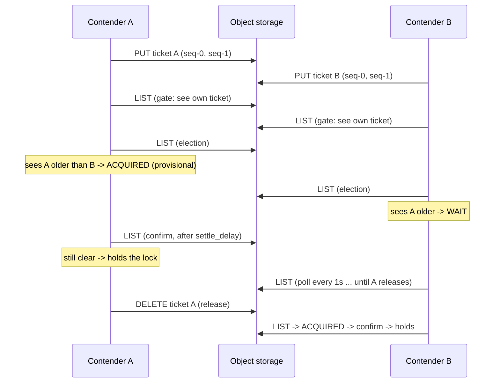

# How the distributed lock works

`s3func` provides mutual exclusion on plain S3-compatible object storage — no
database, no coordinator, and **no compare-and-swap required** (no widely
deployed S3-compatible provider offers a usably atomic conditional PUT; see
`benchmarks/results_visibility_lag.md`). The algorithm is a
[Lamport bakery](https://en.wikipedia.org/wiki/Lamport%27s_bakery_algorithm)-style
election: it only needs atomic single-object PUT/DELETE and a listing.

## The ticket

A contender's "ticket" is **two tiny objects** under the lock prefix:

```
{key}.lock.{lock_id}-0        body b'0' (shared) or b'1' (exclusive)
{key}.lock.{lock_id}-1        same body; its timestamp is the election age
```

- `lock_id` is a random 13-char hex id, unique per contender.
- The body's MD5 (returned in listings as the ETag) identifies the mode —
  shared or exclusive — without extra reads.
- The **seq-1 listing timestamp** is the ticket's age. Two objects are written
  sequentially so a fully visible ticket proves the write completed.

## Acquisition, step by step

```mermaid
flowchart TD
    A["acquire()"] --> B{already won\nthe election?}
    B -- yes --> W[return True]
    B -- no --> C{ticket already exists?\n(recovered via lock_id=)}
    C -- no --> D[PUT seq-0, seq-1\nticket objects]
    C -- yes --> D2[reuse ticket - the election\nstill has to be run]
    D --> E[Self-visibility gate:\nlist until OWN ticket visible]
    D2 --> E
    E -- "timeout" --> X[release + raise:\nlisting can't be trusted]
    E --> F[Election: evaluate_election\nover the parsed listing]
    F -- TICKET_LOST --> Y[release + raise:\nticket was deleted/broken]
    F -- WAIT --> G{blocking? timeout?}
    G -- give up --> H[release, return False]
    G -- keep going --> I[sleep 1s, re-list] --> F
    F -- ACQUIRED --> J[sleep settle_delay,\nre-list once]
    J --> K[Confirming election]
    K -- ACQUIRED --> L[_acquired = True\nreturn True]
    K -- TICKET_LOST --> Y
    K -- WAIT --> G
```

1. **Fast path** — only if *this instance* already won an election
   (`_acquired`). A ticket merely existing in the remote — including one
   recovered with `lock_id=` — is **not** the lock; recovery restores the
   ticket and re-runs the election.
2. **Write the ticket** (skipped when recovered).
3. **Self-visibility gate** — poll the listing until it shows *both of your own
   ticket objects*. A listing that cannot show your own completed writes cannot
   be trusted to show competitors. Raises after `visibility_timeout`
   (default 30 s).
4. **Election** (`evaluate_election`, a pure function over the listing
   snapshot):
    - your own ticket missing/incomplete → `TICKET_LOST` → raise (someone
      deleted it, e.g. `break_other_locks`);
    - any **older** ticket you must yield to → `WAIT`. Exclusive contenders
      yield to any older ticket; shared contenders yield only to older
      *exclusive* tickets (so readers coexist).
    - otherwise → `ACQUIRED`.

    Age comes **only from the listing** — never from your own put-response —
    so every contender compares identical values. Ties (B2 lists timestamps at
    second granularity, so ties are routine under contention) break
    deterministically by lexicographic `lock_id`.
5. **Confirming re-list** — wait `settle_delay` (default 1.0 s), list again,
   and re-run the election. Winning requires **two consecutive clear
   listings**: a violation now needs two *independently stale* listings.
6. **Hold / release** — `release()` deletes the ticket objects (by version id
   where available) and clears `_acquired`. A `weakref.finalize` deletes the
   ticket even if the process dies (best effort). Context-manager usage wraps
   all of this.



## Guarantees and the residual window

- With **strongly consistent listings**, the election is safe: all contenders
  order the same tickets by the same listing timestamps, ties break
  deterministically, and exactly one exclusive winner exists.
- With **eventually consistent listings**, the hardening reduces the failure
  mode to *two consecutive, independently stale listings* for the same
  contender — the gate rejects listings that can't see your own writes, and
  the confirm requires a second clear read. Measured on B2, 80/80 listings
  were consistent on the first poll (see `benchmarks/results_visibility_lag.md`),
  so the residual window is the tail of a distribution we could not observe.
- `break_other_locks()` deliberately deletes other contenders' tickets (for
  dead-lock recovery). The own-ticket invariant means a victim *raises* rather
  than silently "winning" without a ticket — but breaking a live process's
  lock still violates mutual exclusion by design. Use it only on locks you
  know are dead.

## Why each safeguard exists (verified 2026-07-03)

An instrumented multi-process campaign against the pre-0.9.0 lock reproduced
**57 mutual-exclusion violations in 985 acquisitions** and attributed every one
of them via per-poll listing logs — none were storage staleness:

| Root cause | Fix |
| --- | --- |
| Election checked only the *last-iterated* competitor (`locked` reassigned in a loop) — fired whenever ≥3 tickets coexisted | `evaluate_election` scans all competitors and early-returns `WAIT` |
| Contenders judged their own age by put-response timestamps but competitors by listing timestamps; B2 lists at second granularity, so contention ties broke inconsistently (several contenders each "oldest") | age comes only from the listing, for everyone, with the id tiebreak |
| Ticket recovery (`lock_id=`) treated "ticket exists" as "lock held" | recovery re-runs the election; only a won election sets `_acquired` |
| A ticket deleted mid-election let the victim "win" with nothing in storage | own-ticket invariant on every decisive listing → raise |

After the fixes, the same campaign measured **311 acquisitions, 0 violations**.

## Tuning

| Knob | Default | Meaning |
| --- | --- | --- |
| `settle_delay` | 1.0 s | wait between the winning listing and the confirming re-list |
| `visibility_timeout` | 30 s | max wait for your own ticket to appear before giving up |

```python
lock = session.lock('my-resource', settle_delay=0.5, visibility_timeout=10)
```

Every acquisition costs ~3 listings + `settle_delay` of latency; polls while
waiting cost one listing per second. Designed for session-length locks (held
seconds to hours), not high-frequency fine-grained locking.
